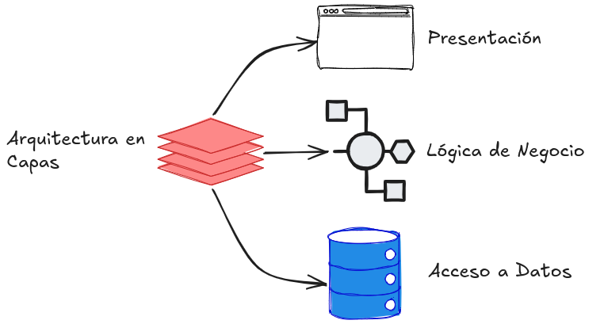
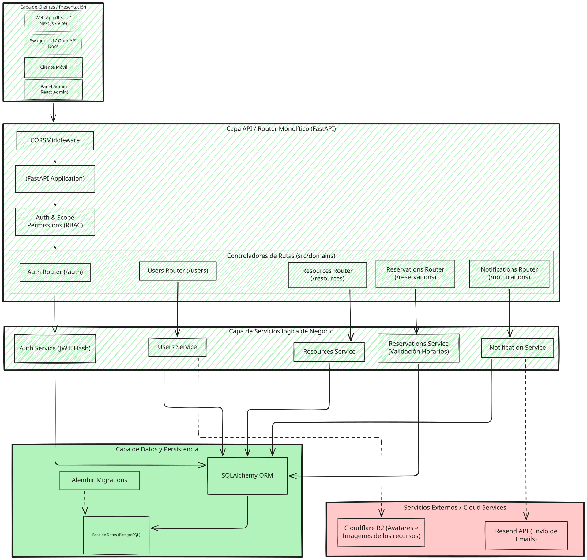
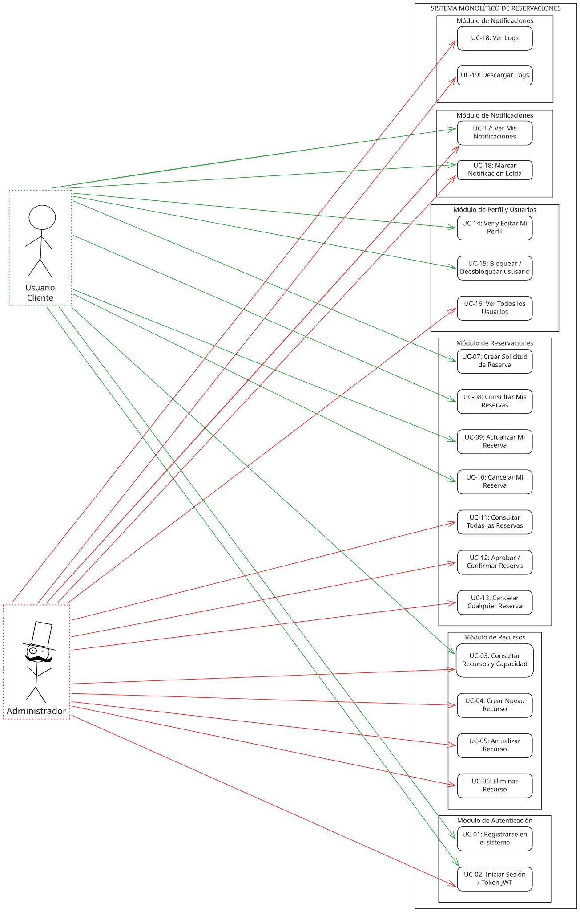
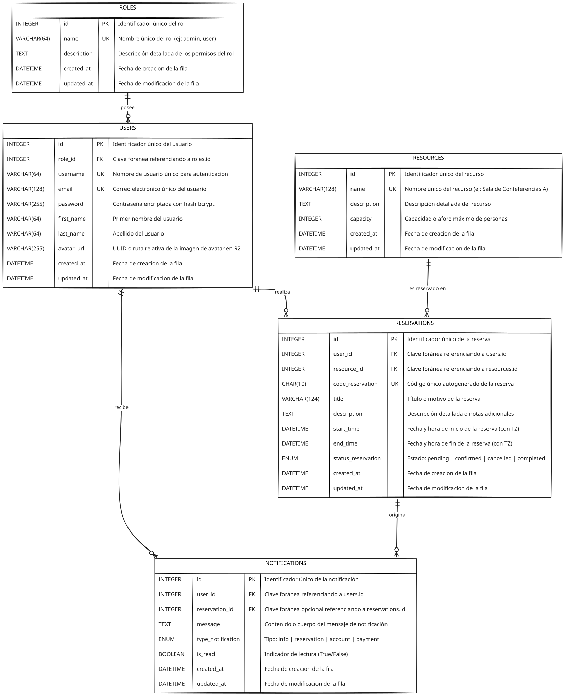
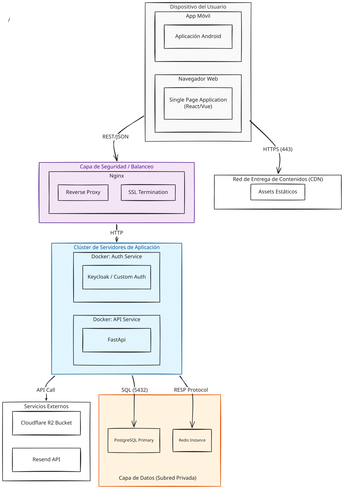
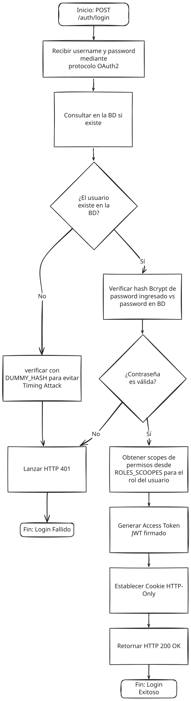
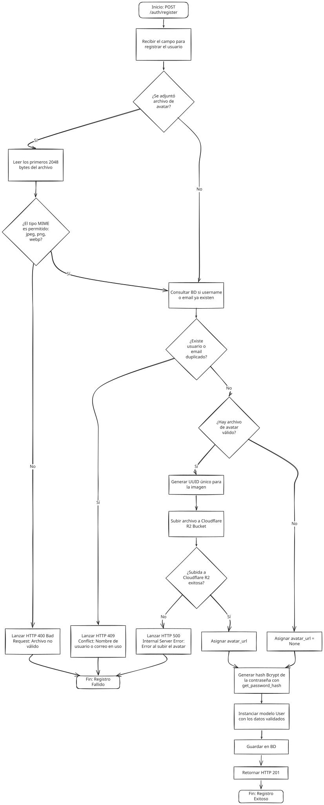

# Documentación Técnica del Proyecto

Esta carpeta centraliza la documentación de apoyo del sistema y complementa la guía principal del repositorio.

Para consultar la instalación, configuración y uso general del proyecto, revisa el [README principal](../README.md).

## 1. Visión general del sistema

El proyecto implementa una API REST monolítica modular para gestionar reservas, recursos, usuarios y notificaciones. La aplicación está construida con FastAPI y sigue una arquitectura por capas, con separación entre presentación, lógica de negocio, acceso a datos y seguridad.

## 2. Arquitectura del sistema

La siguiente vista representa la estructura general de componentes y cómo interactúan la capa de presentación, la lógica de negocio y la persistencia.

### Principios de diseño
- Separación por dominios: auth, users, reservations, resources, notifications.
- API REST con autenticación basada en JWT y cookies.
- Control de permisos por scopes para rutas sensibles.
- Persistencia con SQLAlchemy + PostgreSQL.
- Soporte para almacenamiento de avatar en R2/S3.
- Procesamiento de notificaciones y reservas con reglas de negocio centralizadas.

## 3. Casos de uso del sistema

Los usuarios pueden autenticarse, crear y consultar reservas, administrar recursos y actualizar su perfil. Los administradores tienen permisos adicionales para gestionar recursos y revisar la actividad global.

## 4. Modelo de datos

La base de datos modela usuarios, roles, recursos, reservas y notificaciones. La relación principal gira en torno a la reserva de recursos por usuario.

### Entidades principales
- `User`: perfil, cuenta, avatar, rol y relaciones con reservas/notificaciones.
- `Role`: permisos y nivel de acceso del usuario.
- `Resource`: espacio o elemento disponible para reservar.
- `Reservation`: evento de asignación con fechas, estado y código interno.
- `Notification`: mensajes y alertas vinculadas a usuarios o reservas.

## 5. Despliegue y entorno

El sistema puede desplegarse como API monolítica en un entorno de desarrollo o producción, con PostgreSQL como motor de persistencia y servicios externos para archivos y correo.

## 6. Flujos de autenticación

### Login

### Registro

## 7. Módulos del proyecto

- `src/domains/auth`: autenticación, registro, login y manejo de usuarios.
- `src/domains/resources`: recursos reservables, filtros y administración.
- `src/domains/reservations`: flujo principal de reservas, aprobación y cancelación.
- `src/domains/users`: perfil, actualización de avatar y consulta de usuarios.
- `src/domains/notifications`: notificaciones y comunicación con el usuario.
- `src/core`: seguridad, permisos, utilidades y configuración global.

## 8. Documentación relacionada

- [README principal](../README.md)
- [Pruebas automatizadas](../test/README-TEST.md)
- [Pruebas de carga](../load_tests/README.md)
- [Guía de carga de pruebas](../load_tests/README.md)

## 9. Recomendaciones de uso

1. Configura el archivo `.env` con las credenciales de PostgreSQL, JWT y servicios externos.
2. Ejecuta las migraciones con Alembic antes de probar la API.
3. Usa Swagger en `/docs` para inspeccionar y probar endpoints.
4. Mantén la documentación sincronizada con los cambios de dominio y permisos.
